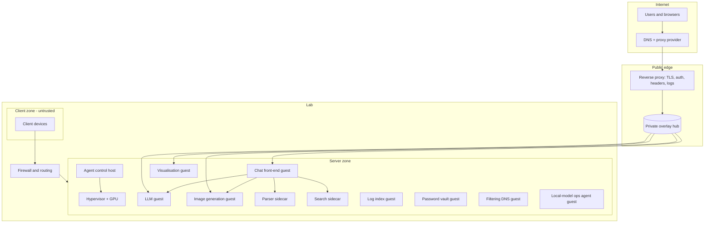
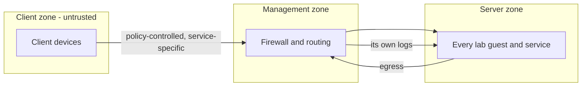
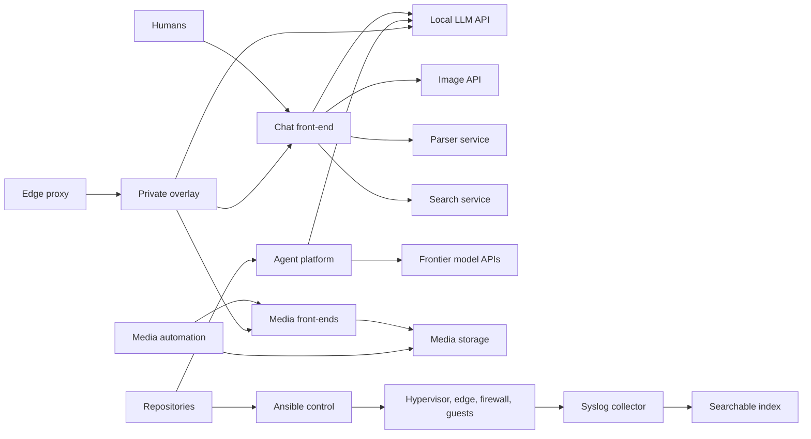
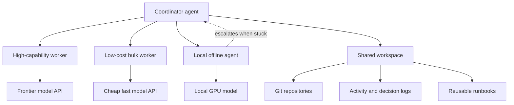

# The Lab Handbook

A guided tour of a small self-hosted lab: **what it does, how the pieces fit together, how it got
here, and what is actually running right now.**

> **Public by intention, sanitised by design.** This documents architecture and operations in
> detail. It contains **no credentials** of any kind, and nothing that locates the lab: **no IP
> addresses, no real domain names, no access paths**. Services and guests are referred to
> **by role**, which is the useful part — never by address or domain. See [Conventions](#conventions).

**This handbook is also published as a static website**, built from the `site/` directory in this repository (see [site/README.md](site/README.md)). The markdown here remains the source of truth.

**New here, or not technical? Start with [Explain It Like I'm 5](docs/eli5.md)** — plain language, no jargon.

**Want to build this yourself? Start with [Build Your Own](docs/build-your-own.md)** — the Proxmox host, the VPS edge, and the agent VM, step by step.

---

**Reconciled 2026-10-01:** see [current status and known gaps](docs/current-status.md).
Historical deployment proofs are not a fresh whole-estate health check.

## At a glance

| Area | Summary |
|---|---|
| **Hypervisor** | One Proxmox VE host; the only machine with a GPU |
| **Guests** | 10 containers + 3 virtual machines in service; 7 retired guests reclaimed |
| **GPU** | A single 8 GB NVIDIA card, deliberately shared between LLM inference, media transcoding and image generation |
| **Edge** | A public VPS terminating Cloudflare-fronted HTTPS, joined to the lab by WireGuard |
| **AI platform** | Local LLM, a chat front-end, image generation, archive-aware file ingestion, web search |
| **Agents** | A coordinator/worker agent platform with risk- and cost-based model routing and a local offline agent |
| **Operations** | Ansible for patching and config capture, Git as the source of truth, centralised syslog into a searchable index |
| **Networking** | Three zones — management, client, servers — with zero-trust egress from the client zone |

---

## Conventions

Because this repository is a description rather than an inventory, addresses and names are abstracted:

| Placeholder | Means |
|---|---|
| `<hypervisor>` | The physical Proxmox host |
| `<mgmt-subnet>` | Management network |
| `<client-subnet>` | Untrusted client network |
| `<server-subnet>` | Server network (all lab guests) |
| `<tunnel-net>` | The private overlay network between the edge and the lab |
| `<edge-vps>` | The public edge host |
| `<service>.<lab-domain>` | Any published service hostname |
| `<guest>` | Any individual container or VM, named by role |

Guests are named by **role** — `plex`, `jellyfin`, `logging`, `vault`, `pihole`,
`ops-llm`, `ops-agent`, `open-webui`, `image-gen`, `gods-eye-view` — because the role is
the useful part and the address is not.

---

## The story

### Where we started

The lab began as a single Proxmox host running a collection of guests that had accumulated
organically. A service would be built, half-finished, replaced, and left switched off. By the time
consolidation began, the host carried **seven retired guests** — several still literally named
`*-retired-pending-deletion` — duplicated agent VMs across two generations, a storage pool close to
full, and configuration that lived in shell history rather than in a repository.

Three problems stood out:

1. **No source of truth.** Configuration and knowledge existed only on the hosts themselves, so a
   rebuild meant archaeology.
2. **Secrets hygiene.** Credentials were scattered across the estate, and some services assumed
   nothing would ever be discovered by anyone else.
3. **No shared spine.** Media, logging, DNS, secrets, AI and public access were separate islands with
   no consistent patterns between them.

### What we changed

**1. Made Git the source of truth.** Every material change now lands in a repository — an operating
contract, an activity log, a decision log, runbooks, and captured host configuration. *If it is not in
Git, it did not happen.*

**2. Cleaned up the estate.** Abandoned guests were captured (config preserved) and destroyed; their
roles were folded into properly named, documented replacements. Seven guests were reclaimed, returning
the storage pool from nearly full to roughly one-eighth used.

**3. Built a real edge.** Instead of exposing services directly, we built a proper edge: a public VPS
terminating TLS behind a DNS proxy, joined to the lab by a private overlay network. Nothing in the lab
is reachable from the internet except through that edge, and every published service is authenticated
at exactly one layer.

**4. Consolidated the AI platform.** A local GPU LLM so the lab does not depend on a paid API for
routine work, surfaced through a full-featured chat front-end, with image generation, web search, and
document *and archive* ingestion.

**5. Put operations on rails.** Ansible handles patching and config capture; logs from the hypervisor,
the edge, the firewall and the guests flow into one searchable index; the agent platform runs from a
documented workspace with explicit rules.

### Where we are now

A small, documented, reproducible platform: segmented networks, a secured edge, a shared GPU doing
three jobs, centralised observability, and an AI layer that is genuinely usable from a browser — with
the whole thing described in Git rather than in someone's memory.

---

## Architecture

---

## Network zones

- **The client zone is untrusted.** Devices there reach specific services, not the network. Egress is
  policy-controlled rather than open.
- **Servers share one zone.** For a lab of this size, segmentation is done at the firewall and by
  service authentication rather than by proliferating VLANs.
- **Filtering DNS** serves the lab, and the firewall forwards its own logs to the collector, so policy
  changes are auditable rather than folklore.

---

## What is in play right now

### Compute

| Host | Role | Notes |
|---|---|---|
| `<hypervisor>` | Proxmox VE | Key-only root SSH; sole owner of the GPU |
| `<agent-host>` | Agent control host | Runs the coordinator agents; the Ansible control node |
| `<storage-host>` | Storage server | Serves the media library read-only to consumers |
| `<automation-host>` | Automation host | Request management, indexers, download automation |

### Services, by role

| Service | Kind | Role |
|---|---|---|
| **plex** / **jellyfin** | containers | Two media front-ends, both using GPU transcoding |
| **nfs-media** | VM | The media library itself |
| **media-automation** | VM | Fulfils media requests and keeps the library organised |
| **logging** | container | Syslog collector feeding a searchable index |
| **vault** | container | Self-hosted password vault for humans |
| **pihole** | container | Network-wide DNS filtering |
| **ops-llm** | container | Local GPU LLM behind an OpenAI-compatible API |
| **open-webui** | container | Chat front-end: RAG, uploads, image generation, search |
| **image-gen** | container | Text-to-image API (Automatic1111-compatible) |
| **gods-eye-view** | container | Geospatial visualisation application |
| **ops-agent** | container | Operations agent backed by the local model |

Full detail — including how each one is built and what would break — is in
[docs/services.md](docs/services.md).

---

## The integrations, at a glance

The lab's value is less in any single service than in how they are wired together. The full map is in
[docs/integrations.md](docs/integrations.md); the short version:

---

## The agent platform

The lab runs an agent platform, not just a chatbot. In brief — full detail in
[docs/agents.md](docs/agents.md):

- Agents are **routed by risk and cost**: capable models for coordination, ambiguity and security work;
  cheap fast models for high-volume discovery and summarisation; the local model for offline work.
- All agents share **one workspace and one set of written rules**, and they store durable state in Git
  rather than in conversation history.
- Subordinate output is treated as **evidence to be verified**, never as a result to be relayed.
- Risky or irreversible actions are gated on a human decision.

---

## Repositories

| Repository | Contents |
|---|---|
| **operating repo** | The agent operating contract, workspace, operational scripts, activity log, decision log |
| **lab-control** | Ansible inventory and playbooks, per-service runbooks, captured host configuration, security reviews |
| **lab-handbook** (this) | The narrative: architecture, services, integrations, agents and lessons |

House rules:

- Git is the source of truth; every material change is logged.
- **No secrets in Git** — ever. Credentials live in a managed secret store or in local-only files.
- Changes are reversible, and rollback is written down *before* the change is made.

---

## Documentation map

Every document in this handbook, and what it is for.

### Start here

| Document | Read it for |
|---|---|
| [docs/eli5.md](docs/eli5.md) | Plain-language explanation - start here if you are not technical |
| [docs/architecture.md](docs/architecture.md) | Compute, zones, storage, capacity |
| [docs/services.md](docs/services.md) | Every service: what it is, how it runs, how it fails |
| [docs/integrations.md](docs/integrations.md) | How everything talks to everything |

### Systems in depth

| Document | Read it for |
|---|---|
| [docs/agents.md](docs/agents.md) | The agent platform in depth |
| [docs/rollout.md](docs/rollout.md) | Current phased rollout and single-provider direction |
| [docs/ai-platform.md](docs/ai-platform.md) | LLM, chat, images, archives, search |
| [docs/cost-expectations.md](docs/cost-expectations.md) | What this costs to run - realistic expectations, and why context is the real driver |
| [docs/agent-org-chart.md](docs/agent-org-chart.md) | The agent org chart: roles, personalities, and what each may not do |
| [docs/edge-and-security.md](docs/edge-and-security.md) | Trust boundaries, auth model, hardening |

### Operating it

| Document | Read it for |
|---|---|
| [docs/operations.md](docs/operations.md) | The change loop, config-as-code, observability |
| [docs/current-status.md](docs/current-status.md) | What is recorded as running, and the known gaps and limitations |
| [docs/lessons.md](docs/lessons.md) | The expensive lessons, written down |

### Build it yourself

| Document | Read it for |
|---|---|
| [docs/build-your-own.md](docs/build-your-own.md) | The build sequence, end to end |
| [docs/build-proxmox-host.md](docs/build-proxmox-host.md) | The hypervisor |
| [docs/build-vps-edge.md](docs/build-vps-edge.md) | The public edge host |
| [docs/build-agent-vm.md](docs/build-agent-vm.md) | The agent host |

---

## Appendix — what is deliberately excluded

This handbook is a **description**, not a credential store or a login guide. Excluded on purpose:
passwords and passphrases, API tokens and keys, private overlay keys, SSH private keys, vault contents,
session databases, real hostnames, real domain names and real IP addresses. Where a credential exists,
this document at most notes *that* one is required — never its value or its location.
