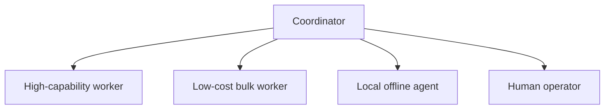
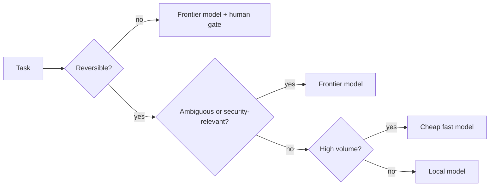
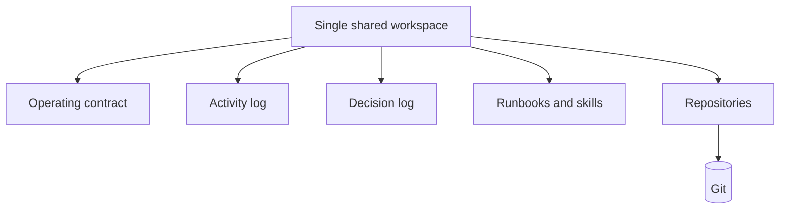
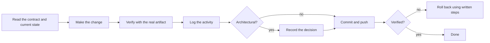
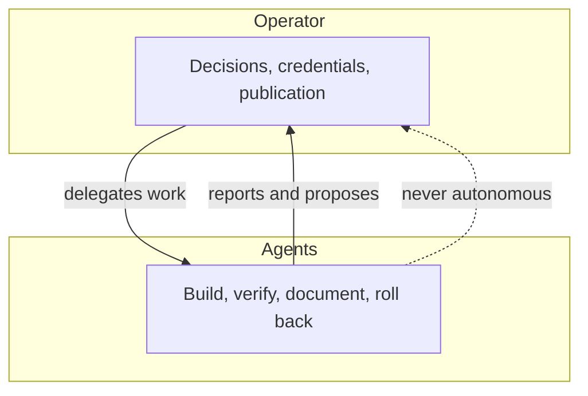
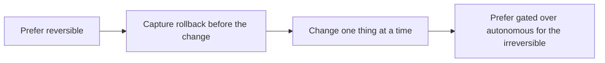
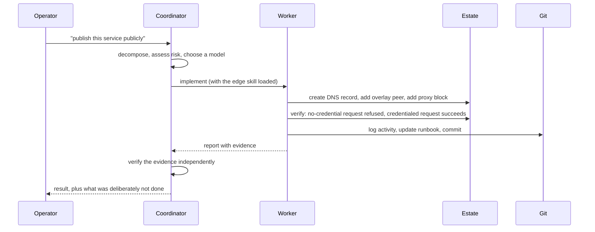

# The agent platform

_Detail behind the [README](../README.md). How automated work is organised, routed and kept honest._

The lab does not just run a chatbot. It runs an **agent platform**: software that takes a task, does
multi-step work against real infrastructure, verifies it, and records what it did.

---

## Why agents at all

Running a lab is mostly undifferentiated work: patching, checking, capturing configuration, writing
down what changed. That work is:

- **Bounded** — the correct outcome is checkable.
- **Repetitive** — the same shapes recur.
- **Reversible or gated** — most of it can be undone, and the rest can require approval.

Those three properties are exactly what makes a task safe to hand to an agent. Work that is ambiguous,
irreversible, or security-critical is not *forbidden* — it is **routed to a more capable model and
gated on a human decision** rather than handed to the cheapest worker.

---

## The roster

| Role | Model class | Used for |
|---|---|---|
| **Coordinator** | Frontier | Decomposition, ambiguity, security-sensitive judgement, final verification, talking to the operator |
| **High-capability worker** | Frontier | Real implementation, debugging, review |
| **Low-cost bulk worker** | Cheap and fast | Discovery, summarisation, classification, reversible first passes |
| **Local offline agent** | The lab's own GPU model | Always-available operations work with no external dependency; escalates when stuck |

The **local agent is the interesting one**: it runs on its own guest against the lab's own LLM, so it
keeps working when the internet or a provider does not. It is deliberately given an escalation path,
because a small local model is good at *routine* operations and bad at novel reasoning — and pretending
otherwise is how you get confident nonsense.

---

## Model routing

Routing is by **risk and cost**, not by availability:

Two consequences worth stating plainly:

1. **The expensive model is not the default.** Most work is cheap work, and treating it as cheap is
   what makes the platform affordable to run continuously.
2. **Escalation is a feature.** A worker that recognises it is out of its depth and hands up is worth
   more than a worker that never admits it.

---

## Shared state, not shared memory

Agents do not rely on conversation history for correctness. Durable state lives in Git:

| Artefact | Purpose |
|---|---|
| **Operating contract** | The rules every agent reads before acting |
| **Activity log** | What changed, when, and how it was verified |
| **Decision log** | Architectural choices with alternatives, consequences, rollback |
| **Runbooks** | Rebuild and rollback instructions per service |
| **Repositories** | Configuration, playbooks and captured host state |

**Why:** conversation context is lossy, private to one session, and invisible to the next agent.
A repository is none of those things.

---

## The task lifecycle

The **unusual** step is "verify with the real artifact". It is not enough that a service was
configured. The image must render, the archive must extract, the page must load, the file must contain
the expected text. Several of this lab's most expensive mistakes were configurations that validated
perfectly and did nothing.

---

## Guardrails

### Authority

Agents may build, verify, document, and roll back their own work. They do not decide to expand
exposure, rotate credentials, or take irreversible action. Those require the operator.

### Secrets

- Credentials live in a **managed secret store**, injected into the environment only for the hosts they
  are scoped to. They are never written into repositories, and never printed into logs.
- Where a credential must be *used*, it is consumed by the command that needs it, not read into the
  agent's reasoning.
- Repositories are private as a second layer, not as the primary control.

### Verification of subordinate work

A worker's report is **evidence**, not a conclusion. The coordinator checks the artifact before acting
on it. This is the same rule as "verify with the real artifact", applied to people-shaped inputs.

### Blast radius

---

## Skills: reusable procedure

Because the same tasks recur, procedure is captured as **skills** — short, opinionated runbooks that
an agent loads when the task matches. Examples in this lab:

| Skill | Covers |
|---|---|
| Edge operations | Publishing, unpublishing, password-protecting, overlay peers |
| Service deployment | Standing up a web app or container service on its own guest |
| Protected credentials | Requesting and consuming stored secrets without seeing them |
| Hypervisor access | Key installation and verification for guests |
| GPU media guests | Handing the shared GPU to a guest and proving it works |
| Log collection | Standing up a collector and pointing sources at it |
| Secrets handling | Reading and relocating credential files safely |

Skills encode the **sharp edges** discovered the hard way — the tunnel MTU that must be pinned, the
JSON output that must be enabled, the step count that must be lowered. A skill is where a lesson stops
being a memory and becomes a procedure.

---

## What the platform does not do

- **It does not act on its own goals.** There are no standing objectives, no self-directed expansion,
  no background acquisition of capability.
- **It does not hold credentials it does not need.** Access is per-task and scoped.
- **It does not hide its work.** Every material action lands in a log someone can read.
- **It does not treat a green check as proof.** The artifact is the proof.

---

## A worked example

A representative task end to end:

The last line matters as much as the first: the platform is expected to say what it did **and** what it
left alone, including the gaps it knows about.
## Current routing override

The operator has selected DeepSeek-only routing for all seven configured coordinator/worker
identities, without automatic provider fallback. The tiered-model diagrams and descriptions below
describe the prior design, not current routing policy. The local offline service is a separate
capability. See [rollout](rollout.md) for runtime verification gates and sequencing.
