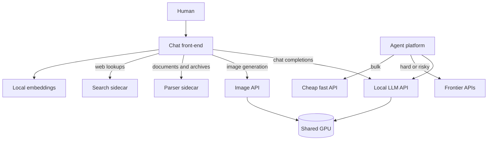
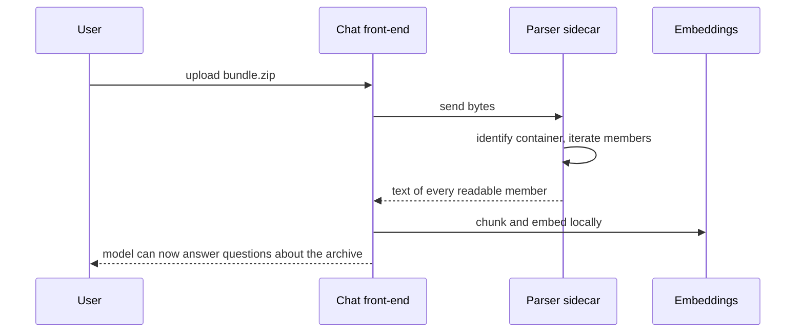
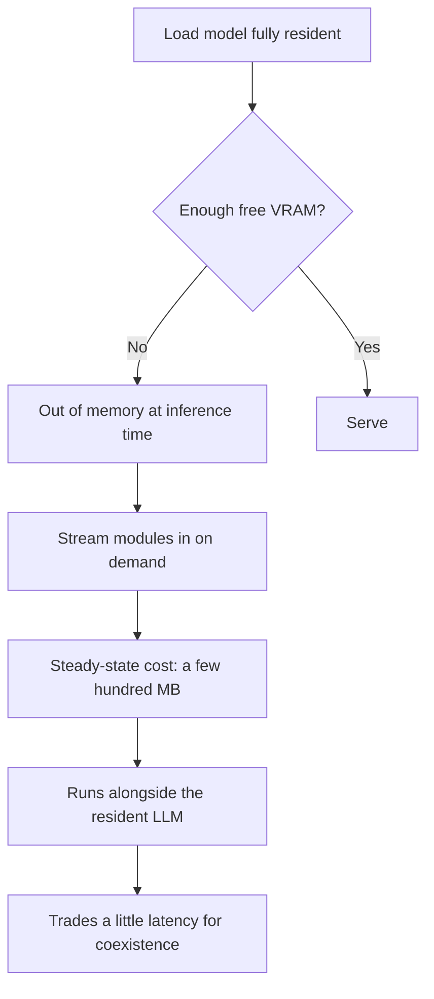
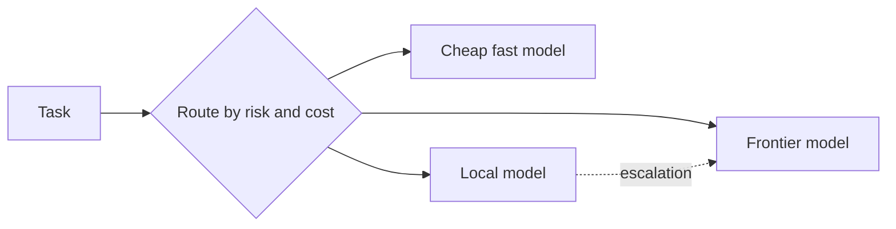

# The AI platform

_Detail behind the [README](../README.md). No addresses; roles only._

## Why a local model at all

Running a frontier model API is easy; running a **local** one is a statement about independence. The
local model exists so that:

- Routine work costs nothing per token and can run continuously.
- Operations keep working when the internet or a provider is unavailable.
- Documents and archives uploaded by users are **never sent anywhere** to be read or indexed.

The trade is capability: a local 7B model is not a frontier model. The platform accepts that honestly
and keeps an escalation path rather than pretending the small model is enough.

## Shape of the stack

Everything is reached over **OpenAI-compatible APIs**. That uniformity is deliberate: the chat
front-end, the agents, and any future tool all speak one shape, so a component can be replaced without
rewriting its callers.

## The local LLM

| Aspect | Detail |
|---|---|
| Serving | `llama.cpp`, OpenAI-compatible endpoint |
| Model | A quantised 7B-class coding-oriented model |
| Residency | Loaded resident; it owns roughly 5 GB of the 8 GB card |
| API key | A placeholder — the endpoint is internal |

Quantisation is what makes a 7B model fit alongside other GPU work at all. The model is chosen for
*operations* work — reading configuration, writing scripts, summarising — not for open-ended reasoning.

## The chat front-end

| Capability | How |
|---|---|
| Accounts, conversations, folders | Application-native |
| File upload with retrieval | Local embeddings — `sentence-transformers`-class model, no external service |
| Document **and archive** reading | Parser sidecar |
| Image generation | Image API |
| Web lookups | Search sidecar |
| Code execution | In-browser Python engine (no server-side execution) |

**Local embeddings are the quiet win.** Retrieval happens without a single byte of a user's document
leaving the lab.

**What it cannot do:** understand images. There is no vision model and no multimodal projector, so an
uploaded *picture* is opaque to the model. Documents and archives are readable; photographs are not.
This is the stack's clearest remaining gap.

## Document and archive ingestion

The interesting part is archives. Users routinely have a zip of logs, source, or a bundle of documents,
and handing the model an opaque blob is useless.

Supported containers include **zip, tar, tar.gz, tar.bz2, gzip, bzip2, 7z, cpio, ar** and more.
Binary members are skipped safely rather than corrupted into text, and nested directories are preserved
as member paths so the model can tell files apart.

**Why a sidecar rather than built-in support:** the front-end does not need to know what a zip is. It
knows how to ask a parser for text. Every format the parser understands — and every format someone adds
to it later — arrives for free.

## Image generation

| Aspect | Detail |
|---|---|
| Model | A **distilled few-step** diffusion model (1-4 steps) |
| Interface | Automatic1111-compatible API |
| Resolution | Small by design (512-class) |
| Why this model | It is the only class of model that tolerates the memory strategy below |

### The memory decision

Measured on the real hardware with the LLM running: **roughly 1.5-2.5 seconds per image** at a cost of
only a couple of hundred megabytes above the resident LLM. The alternative — a fully resident model —
failed outright at inference.

Two rules came out of it:

1. **A GPU is a budget, not a checkbox.** Two workloads that each "fit" may still not fit together.
2. **A few-step model is a sharing strategy, not a compromise.** It is chosen *because* it can stream,
   and its speed is a side effect that happens to be welcome.

## Web search

A self-hosted metasearch service backs the model's web lookups. No API key, no per-query billing, and
queries leave the lab only to the engines the metasearch instance queries.

**The sharp edge:** the metasearch service disables JSON output by default — sensibly, since JSON is
for trusted internal callers. The chat front-end asks for JSON, so it must be enabled explicitly or
every search quietly returns nothing.

## Agents on the platform

Depth is in [agents.md](agents.md); the AI-relevant parts:

- The same OpenAI-compatible contract means switching a worker between the local model and a cloud model
  is configuration, not code.
- The local model gives the platform a **floor** — degraded capability instead of total failure.

## Operating principles

1. **Local first, escalate deliberately.** Paid calls are for work that genuinely needs them.
2. **Verify with the artifact.** Generate the image, extract the archive, run the query.
3. **One capability, one owner.** Parser, search and image generation are services, not embedded logic.
4. **State the gaps.** The vision gap is listed here rather than discovered later.

## What is next

| Item | Why it is not done |
|---|---|
| Vision (image understanding) | Needs a multimodal model plus projector; the GPU is fully committed |
| A higher-quality image model | Would contend with the LLM; sensible only when the card is idle |
| Reranking for retrieval | Nice precision win, more memory on an already busy guest |
