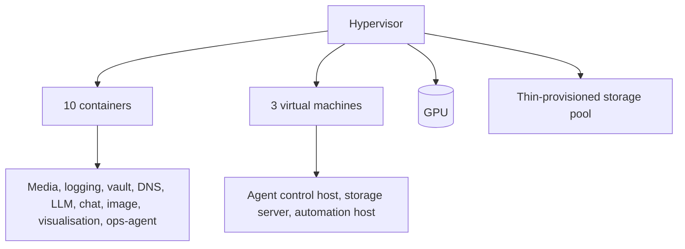
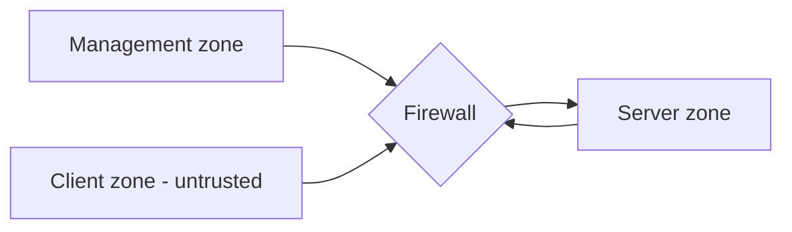
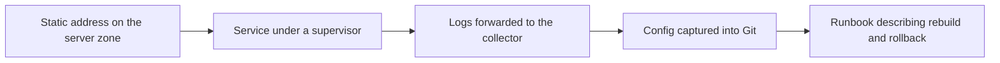
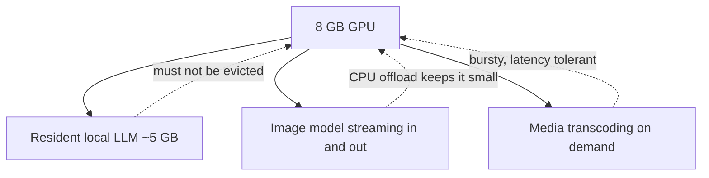

# Architecture

_Detail behind the [README](../README.md). Addresses are abstracted — see the README's conventions._

## Shape of the estate

Everything runs on **one physical hypervisor**. That is a deliberate trade: a single host is simple,
cheap and easy to reason about, and the lab's purpose is to make the *patterns* right rather than to
demonstrate high availability. The cost is obvious — the hypervisor is a single point of failure, and
its GPU is a single point of contention.

### Why containers for most things

Most services are Linux containers: cheap, fast to clone, and a natural fit for single-process
services. Virtual machines are reserved for the three guests that want a real kernel of their own —
the agent control host, the storage server, and the media automation host.

## Zones

| Zone | Character |
|---|---|
| **Management** | The firewall and the infrastructure that defines policy |
| **Client** | Treated as hostile. Devices reach named services, not the network |
| **Server** | All guests. Reached from the client zone only through explicit policy |

Client-to-server access is allowlisted, not universally denied. Selected management and AI
interfaces are explicitly reachable from the client zone. A compromised client can attempt those
allowed services; application authentication and narrow destination rules still matter.

## Storage

Two distinct storage ideas coexist:

- **Guest disks** live on a thin-provisioned LVM pool. Thin provisioning means guests can each be
  given generous disks without pre-allocating the whole estate — but it also means the pool's
  *actual* usage is the number that matters, and it is invisible in the place people usually look.
- **Media** lives on its own guest and is exported to the media front-ends **read-only**, so a
  misbehaving application cannot damage the library.

**Capacity lesson:** after the cleanup, the reclaim showed up in the thin pool's data percentage and
not in the volume group's free space. A volume group that hosts a thin pool reports *its own*
unallocated space, which barely moves when guest volumes are deleted. Watching the wrong number makes
a successful reclaim look like a failed one.

## Guest anatomy

Each guest follows the same shape:

That shape is the point. A guest without a runbook is a guest that cannot be rebuilt.

## Resource headroom

| Resource | Character |
|---|---|
| CPU | Comfortably over-provisioned; the hypervisor schedules it |
| Memory | Generous per guest; the GPU host is the tight one |
| Storage | Thin pool back to roughly one-eighth used after reclamation |
| GPU | **The scarce resource** — see below |

## The GPU is the constraint

One 8 GB card serves three workloads. Design decisions follow from it, not from preference.

Two rules emerged:

1. **The resident workload wins.** The LLM loads once and stays. Anything else must fit around it.
2. **Streaming beats resident for the second model.** A model that loads its modules on demand costs a
   little latency and almost no standing memory — which is the only way two models coexist on this card.

## Growth path

- Add a second hypervisor and move the always-on services to it, leaving the GPU host for GPU work.
- Split the LLM and the image model onto different cards so neither has to yield.
- Keep the media library on dedicated storage rather than a guest disk.
