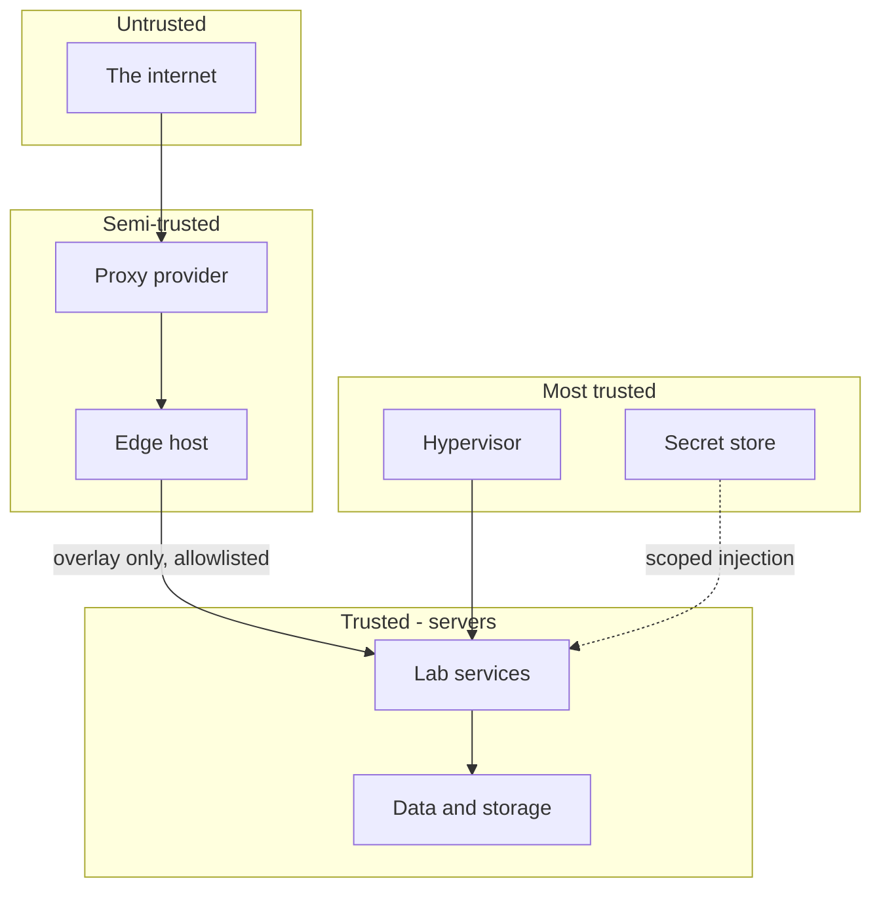
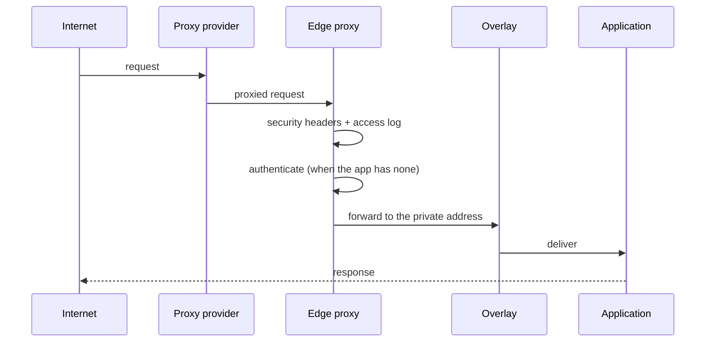
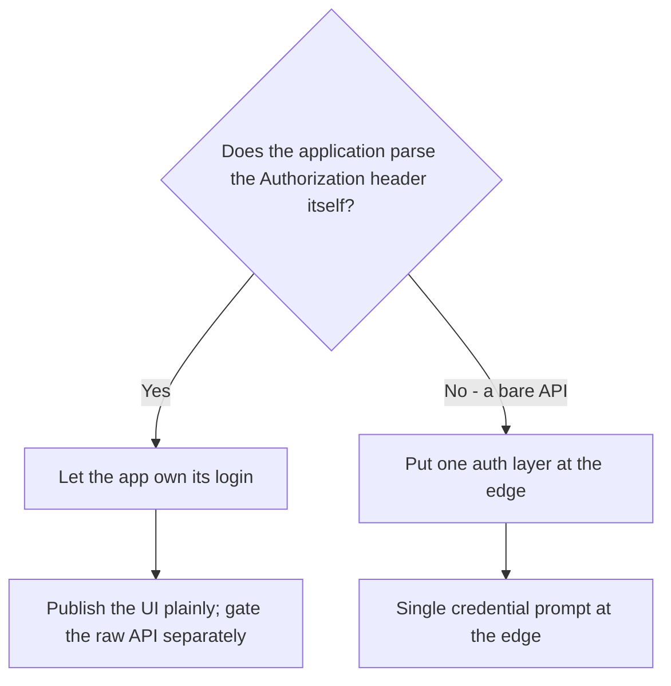
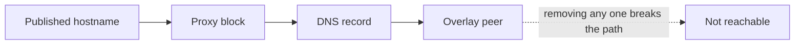
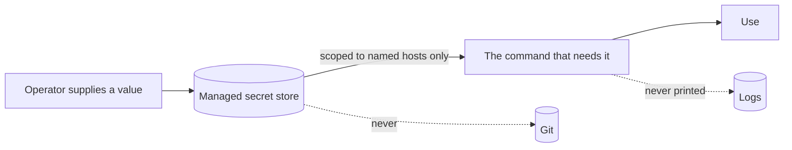
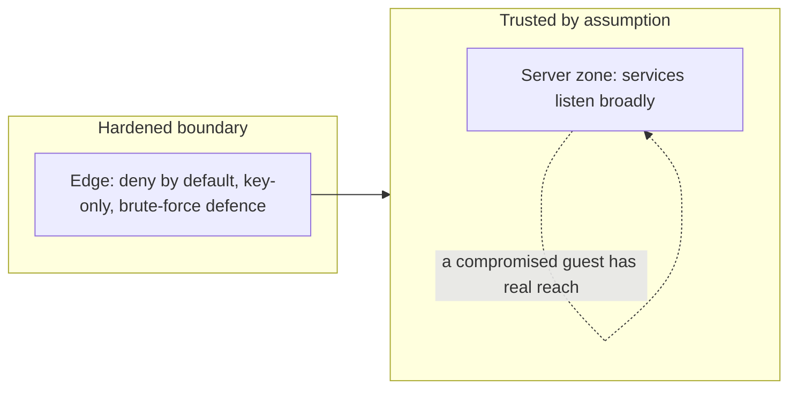

# Edge and security posture

_Detail behind the [README](../README.md). No addresses, hostnames or credentials._

## The principle

**Internet-facing services use the edge.** A public service exists only because it was deliberately
published through the edge, with authentication, and with the ability to unpublish it in one step.

## Trust boundaries

Every boundary is crossed in exactly one direction and for a stated reason. The interesting crossings:

| Boundary | Control |
|---|---|
| Internet to provider | Provider absorbs floods, hides origin, terminates the public edge |
| Provider to edge host | Host firewall allows HTTP/HTTPS **only** from the provider |
| Edge host to lab | Private overlay; lab services have no public listeners |
| Lab to secrets | Scoped injection for a named host; never a wildcard |
| Client zone to management | Explicit destination/service allowances; not a blanket isolation claim |

## The edge chain

## The authentication model

**Exactly one authentication layer per published service.** Two layers is worse than one: it doubles
the failure modes, and the second prompt is usually the one that breaks.

This is not stylistic. HTTP Basic credentials and an application's own bearer token occupy the **same**
request header. If the edge injects a Basic header into a request to an app that reads that header, the
app tries to interpret the edge's credentials as its own token, rejects them, and its front-end signs
the user out — *while the login itself appears to succeed*. The symptom reads as a wrong password,
which is why it consumes so much time.

**Rule of thumb:** an application with a login form gets a bare edge block. A bare API gets an edge
credential. Never both in the same path.

## Exposure discipline

- Public HTTP/HTTPS on the edge host is reachable **only through the provider**; from anywhere else it
  reads as closed. That is intended.
- Lab services are reachable from the internet **only** through the private overlay.
- Every published hostname is individually revocable in three steps: remove the proxy block, remove the
  DNS record, remove the overlay peer.
- The agent platform's own control plane stays **loopback-only** on its host.

## Host hardening

| Control | Applies to |
|---|---|
| SSH hardening | Per-host state varies; a temporary single-account recovery exception is recorded |
| Connection rate limiting on the edge's SSH | Edge host (bursts look like an outage — a known false alarm) |
| Host firewall allowlisting the provider | Edge host |
| Private overlay instead of open ports | All lab services |
| Repositories **secret-free** (private where they hold internal detail) | Everything |

## Secrets handling

- Credentials are stored in a **managed secret store**, not in files inside repositories.
- A stored credential is injected into the environment for **specific destinations only**; a request to
  any other host gets nothing.
- Agents **use** credentials without reading them into their reasoning whenever the tooling allows.
- Being secret-free is the first layer of defence; repository privacy is only a second.
- Nothing that grants access is documented — not the value, not the location.

## What we would not do

- Put two auth layers on one path.
- Expose a lab service directly to the internet.
- Store a credential in Git "temporarily".
- Let an agent decide to widen exposure.
- Treat a validated configuration as a working service.

## Internal trust — the honest caveat

The edge is hardened; the server zone is where the assumptions live.

A security review found that most services in the server zone listen on **all interfaces** and rely on
the network boundary rather than on authentication. That is a defensible posture for a lab — but it
should be stated rather than assumed, because it means a single compromised guest currently has a lot
of reach: it could call the model APIs, query the log index, and reach management interfaces.

The two exposures that were least defensible have been fixed: an unauthenticated document parser and
the full log index are no longer reachable from the network. The remaining items are mostly **policy
choices** about how much the internal network should be trusted, and they are tracked as findings
rather than silently accepted.

**If you build this pattern yourself:** decide explicitly whether the internal network is trusted. If it
is not, every service needs either its own authentication or a source restriction at the firewall — and
the day you discover this by compromise is too late to make it a choice.

## Administrative UI and recovery exceptions

The Gateway listener stays loopback-only. An HTTPS reverse proxy on the control host
provides the approved client-zone path; only the local proxy is trusted to forward client
identity, and it overwrites forwarded headers. Internal certificate trust and browser pairing
may be required. A page returning success does not prove authenticated browser use.

The raw local-model interface has an approved client-zone allowance and was recorded as
unauthenticated. It is distinct from the richer chat front-end, which owns its login.
This is an existing exposure, not a recommendation to publish an unauthenticated model API.

A temporary password-login exception was recorded for one recovery account on the control
host. Removal awaits installation and testing of the operator key; do not describe the entire
estate as uniformly key-only. No credential or credential delivery location belongs here.
