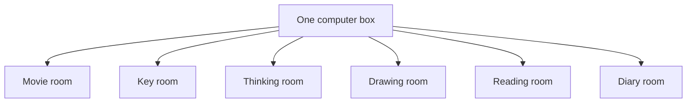
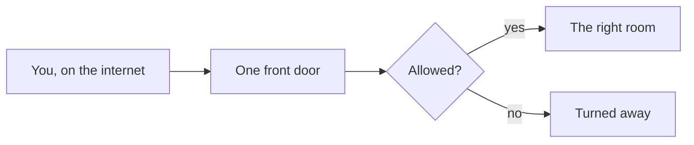
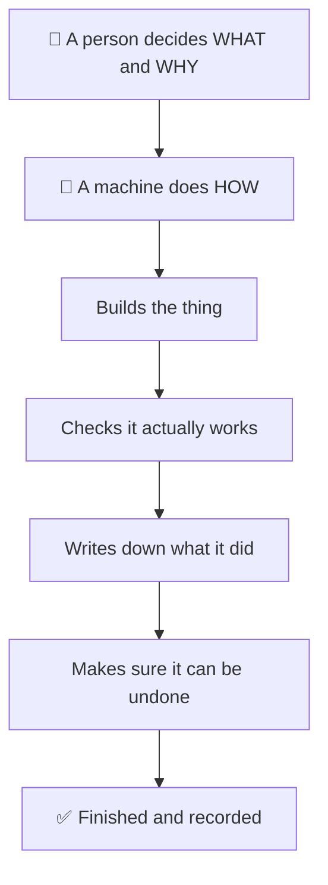
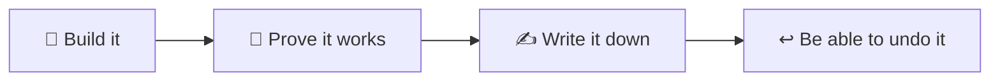
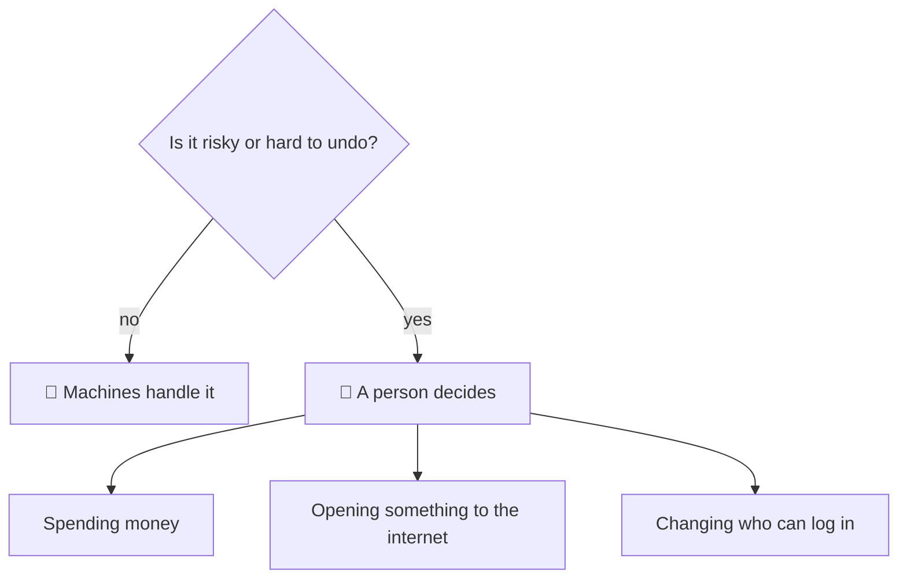

# Explain It Like I'm 5

_No jargon. If you have never seen a server, start here._

---

## What is this thing?

Imagine a **very tall filing cabinet with lots of little rooms inside it.**

Each room does **one job**:

| Room | What it does |
|---|---|
| 🎬 Movie room | Keeps your films and plays them |
| 🔑 Key room | Remembers all your passwords, locked up tight |
| 🧠 Thinking room | Answers questions and helps write things |
| 🎨 Drawing room | Makes pictures when you ask for one |
| 📚 Reading room | Reads your documents and archives |
| 🔍 Looking-things-up room | Searches the web when it needs to know something |
| 📝 Diary room | Writes down everything that happens |
| 🚪 Front door | The only way in from the outside |

All of those rooms sit inside **one real computer**, in one physical box.

---

## How does anything get in?

There is exactly **one front door**.

Everything from the internet comes to that door. The door checks who you are, decides if you are allowed, and then walks your request to the right room.

No room has its own door to the street. That is on purpose — one door is much easier to guard than ten.

---

## Here is the part that matters most

**Almost everything in here was built by machines. And machines keep it running.**

Think about a house. A person decides *"we need a room for the movies."* But they do not lay every brick by hand — a builder does that, following a plan, and checking the work.

In this lab, **the builder is a machine.**

A normal day looks like this:

1. A person says: *"the picture room should also read scanned documents."*
2. A machine goes and sets it up.
3. It **tests it by actually using it** — not just by asking "did that work?" and trusting the answer.
4. It writes a note: what changed, why, and how to undo it.
5. If it is not sure, it **says so** instead of guessing.

---

## Why machines doing the work is a big deal

| A person would… | A machine instead… |
|---|---|
| Get tired and rush the last bit | Does the last bit the same as the first |
| Forget to write it down | Writes it down every single time |
| Assume it works because nothing errored | **Checks by actually doing the thing** |
| Maybe not notice a quiet problem | Watches for things that break *silently* |
| Be too polite to say "I don't know" | Says "I couldn't verify this" |

**The most important habit:** never trust "it should work." Go and *use* it, and see.
We have been fooled by this before — a setting that said it was fixed, and wasn't. The machine now
checks the *real result* every time.

---

## The machine's four rules

1. **Build it.**
2. **Prove it works** — by using it, not by assuming.
3. **Write it down** — so the next machine knows.
4. **Be able to undo it** — before starting, not after something goes wrong.

There is a fifth, quieter rule: **if you cannot check it, say so.** An honest "I don't know" is worth
more than a confident guess.

---

## Things that fix themselves, and things that need a person

The machines handle the boring, repeatable, safe work. They also **watch for quiet problems** — like a
backup that stopped running, or a diary that stopped filling up. Nobody would notice those until it was
far too late, so a machine checks every hour.

But some things still need a human:

That is the deal: **machines do the work, people make the risky choices.**

---

## The short version

- One box, many little rooms, each doing one job.
- One front door, carefully guarded.
- **Built by machines, watched by machines, written down by machines.**
- A person sets the direction and makes the risky calls.
- Nothing is believed until it has been *actually tried*.

---

## Where to go next

- [Architecture](architecture.md) — the same picture, but for grown-ups
- [The agent platform](agents.md) — how the machines are organised
- [Lessons](lessons.md) — the mistakes that taught us the rules above
