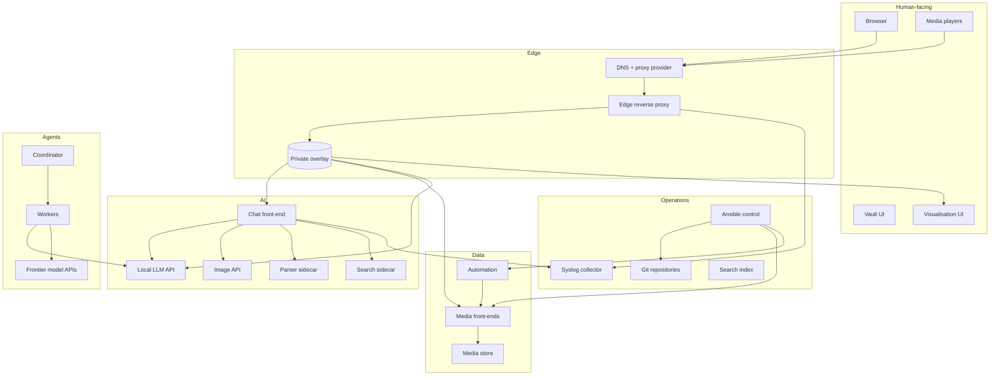
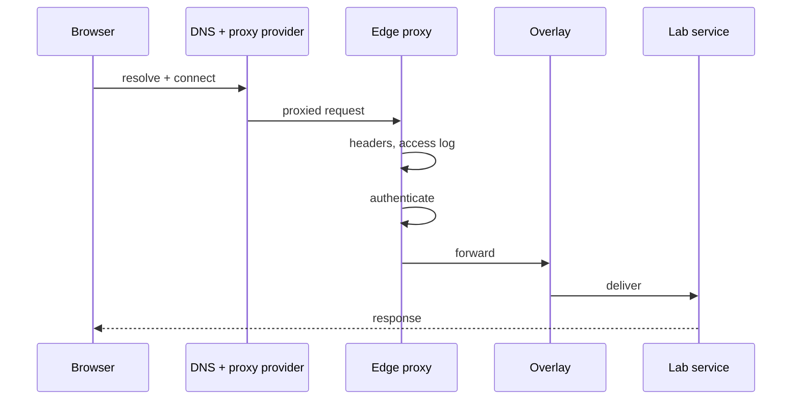
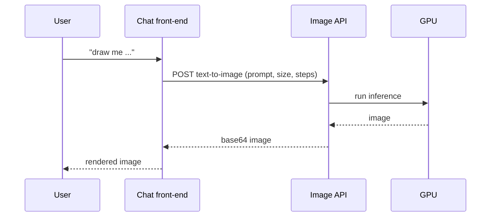
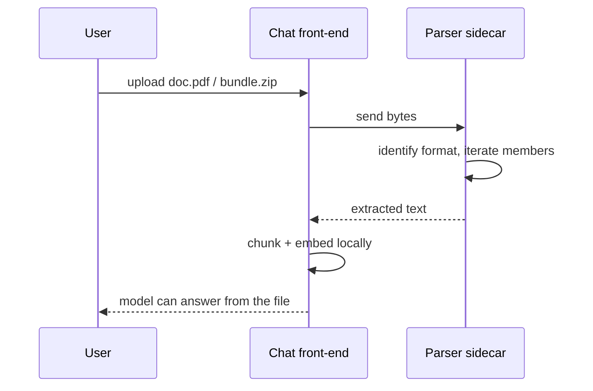
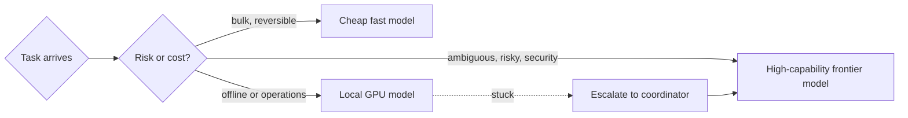
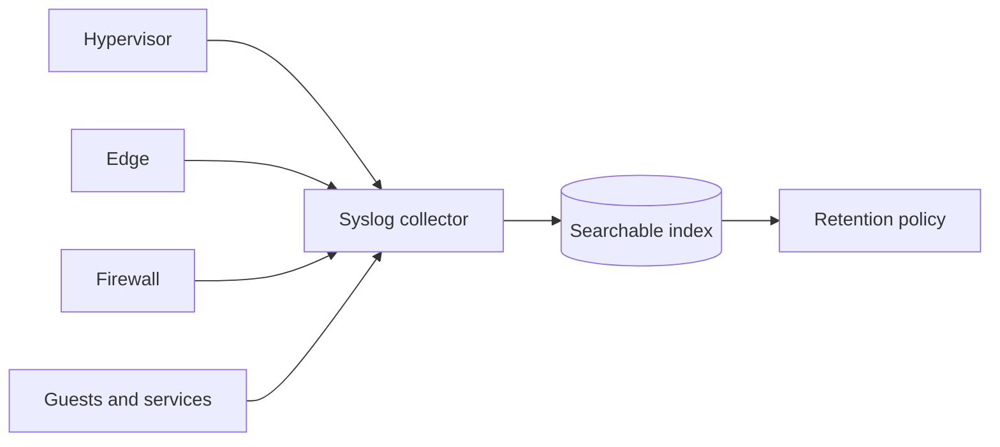
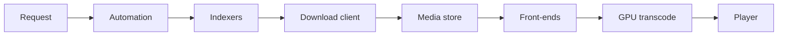

# Integrations

_Detail behind the [README](../README.md). Everything talks to something; this is the map._

An integration is not just a connection — it is a **contract** with a failure mode. Each entry below
records what is wired to what, over which protocol, who owns the credential, and what happens when it
breaks.

---

## The whole map

---

## 1. Browser → published service

- **Contract:** HTTPS in, plain HTTP over the tunnel, a single auth layer.
- **Owner of the credential:** depends on the service — the app, or the edge.
- **Failure mode:** if the overlay is down, *every* published service fails at once while the lab is
  healthy. Distinguishing "edge problem" from "app problem" is the first triage question.

---

## 2. Chat front-end → local LLM

| Aspect | Detail |
|---|---|
| Protocol | OpenAI-compatible HTTP |
| Direction | Chat front-end initiates; the LLM never calls out |
| Credential | A placeholder key — the local LLM does not authenticate |
| Dependency | The GPU |

- **Contract:** chat completions with the OpenAI schema. Any OpenAI-shaped client can be pointed at it.
- **Failure mode:** if the LLM is down, the chat UI loads but every reply fails. If the GPU is busy
  transcoding, replies slow down rather than fail — a nice property of the shared card.

---

## 3. Chat front-end → image API

- **Contract:** the Automatic1111 text-to-image shape — the front-end's own code posts
  `prompt`, `width`, `height`, `steps`, `negative_prompt`. The backend accepts that and
  ignores the rest.
- **Step count is the contract's sharp edge:** the front-end defaults to a large step count that suits
  a conventional diffusion model. A fast distilled model needs **few** steps, so the step count is set
  explicitly rather than left to the default.
- **Failure mode:** if the GPU cannot fit the model, generation fails at inference rather than at load —
  the deceptive shape.

---

## 4. Chat front-end → parser sidecar

- **Contract:** send bytes, accept plain text back. No shared filesystem, no shared credentials.
- **Why a sidecar:** the front-end does not need to know what a zip *is*. Every format the parser
  understands becomes available at once, and adding a format is the parser's problem, not the app's.
- **Failure mode:** if the parser is unreachable, uploads still succeed but index as empty — the user
  sees a file attached and the model "knowing nothing". Worth watching for.

---

## 5. Chat front-end → search sidecar

| Aspect | Detail |
|---|---|
| Protocol | HTTP, JSON result format |
| Credential | None — the search service is internal |
| Direction | Outbound from the front-end to the sidecar |

- **Contract:** the sidecar returns a JSON result set for a query string.
- **Sharp edge:** the metasearch service disables its JSON output by default, with good reason (JSON is
  normally for trusted internal callers). It must be enabled explicitly for this integration to work at
  all — the front-end asks for JSON and gets an error page otherwise.
- **Failure mode:** search silently returns nothing, and the model answers from memory instead.

---

## 6. Agents → models

- **Contract:** every model is reached through an OpenAI-compatible API, so the routing layer is
  uniform and a provider can be swapped without rewriting the work.
- **Credential ownership:** cloud keys live in a managed secret store, are scoped to the provider's
  host, and are injected into the environment rather than written into configuration.
- **Failure mode:** a provider outage degrades capability rather than stopping work, because the local
  model is always available.

---

## 7. Ansible → the estate

| Aspect | Detail |
|---|---|
| Protocol | SSH from one control node |
| Auth | Key-only, one dedicated key |
| Scope | Hypervisor + media group today; expanding |

- **Contract:** the control node can reach every managed host with the same identity, and playbooks are
  idempotent.
- **Why it matters:** patching and config capture stop being manual rituals and become reproducible
  commands.
- **Failure mode:** a stale inventory — Ansible cheerfully reports success against hosts that no longer
  exist, or misses hosts that were added without being recorded.

---

## 8. Everything → the log index

- **Contract:** syslog, over UDP/TCP, from everything that has an opinion.
- **The firewall and the edge are the important sources:** they are the only places that can answer
  "what is actually exposed" and "who actually connected".
- **Failure mode:** the collector fills its disk and ingestion stops *silently*. Observability outages
  do not announce themselves.

---

## 9. Media pipeline

- **Contract:** the store is read-only to the front-ends, so the pipeline only ever appends.
- **Failure mode:** indexers are the usual culprit, and they fail quietly — the pipeline looks healthy
  while nothing new arrives.

---

## Integration hygiene

1. **One credential per integration**, owned by one side, stored in the secret store — never in Git.
2. **One auth layer.** Two layers is a bug with a support ticket.
3. **Verify with the artifact.** An integration is proven by an extracted archive, a rendered image, a
   returned search result — not by a green status.
4. **Prefer a sidecar to embedded logic.** The parser and search services are capabilities the app
   consumes, not code the app carries.
5. **Write the failure mode down.** If you cannot say how it breaks, you do not yet understand it.
