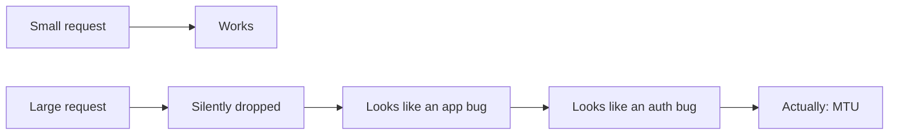

# Lessons

_Detail behind the [README](../README.md). The expensive lessons, written down so they cost time once._

These are not general principles. Each one cost hours in this lab, and each one is now encoded in a
skill or a runbook so it cannot recur silently.

---

## 1. "The network is broken" is often an MTU problem

**Symptom:** a page prompts for a password and then hangs. Small requests succeed. Large ones never
complete. A ping works fine.

**Cause:** an overlay link without working path-MTU discovery. Small packets pass; anything larger is
silently dropped. Nothing errors — the payload simply never arrives.

**Fix:** pin the tunnel's MTU below the path MTU on **both** ends, and verify with a correctly sized
probe.

**Why it was expensive:** it presents as an application or authentication fault, so the investigation
starts in the wrong place entirely.

---

## 2. Two authentication layers can fight

**Symptom:** the login POST succeeds, the profile loads, and then the front-end signs the user out in a
burst. It reads as a wrong password.

**Cause:** an edge fronting an application with its own login, both using the same request header.

**Fix:** exactly one auth layer. Applications with their own login get a bare edge block.

**The trap in the fix:** stripping the header at the edge does **not** work — that same header carries
the application's own token, so removing it breaks the app instead. The fix is architectural, not a
header tweak.

---

## 3. Validation is not verification

**Symptom:** a configuration edit is reported as applied. Validation passes. The reload succeeds.
Nothing changed.

**Cause:** a programmatic edit that matched nothing — often a regular expression aimed at a structure
that had since nested one level deeper.

**Fix:** read the file back after editing. Compare against what you intended, not against the exit code.

**Rule:** every claim of "done" needs an artifact. A rendered image. An extracted archive. A page that
loads. A file that contains the expected text.

---

## 4. A GPU is a budget, not a checkbox

**Symptom:** a model loads successfully, then fails at inference with an out-of-memory error.

**Cause:** two workloads that each fit in 8 GB, but not together. The first owns roughly 5 GB
permanently.

**Fix:** make the second workload **stream** rather than reside. Modules move in on demand; steady-state
cost drops to a few hundred megabytes.

**The design consequence:** the model class is chosen for its ability to stream. A few-step distilled
model tolerates offloading; a conventional many-step model does not.

---

## 5. Retirement is a task, not a state

**Symptom:** guests accumulate, each labelled `*-retired-pending-deletion`, consuming hundreds of
gigabytes of a pool that is slowly filling.

**Cause:** renaming is easy; deleting feels risky; nothing forces the second step.

**Fix:** capture the configuration, then destroy. The configuration is what you might want again — the
disk image almost never is.

---

## 6. Measure the number that actually moves

**Symptom:** several hundred gigabytes of guest disks are deleted and the storage "free space" is
unchanged.

**Cause:** the volume group reports *its own* unallocated space. A thin pool owns the space, so the
volume group's free space barely moves when thin volumes are deleted. The pool's own usage percentage
is the number that moved.

**Fix:** measure the layer that owns the resource. This applies well beyond storage — a container's disk
usage is not the host's, a tunnel's throughput is not the link's.

---

## 7. Silent capability gaps are better stated than hidden

**Symptom:** a user attaches a picture and the model says nothing useful about it. Or attaches an
archive and the model "knows nothing".

**Cause:** no vision model exists; or the parser sidecar is unreachable, so the upload indexes as empty
while the UI still shows the file attached.

**Fix:** state the gap in the documentation, and make the failure mode explicit. A documented gap is a
roadmap item; an undocumented one is a support incident.

---

## 8. The default is often wrong for your case

Three examples, all found the same way:

| Setting | Default | Why it was wrong here |
|---|---|---|
| Diffusion step count | Large (suits conventional models) | A distilled model needs **few** steps; the default is slow and pointless |
| Metasearch JSON output | Disabled | The chat front-end consumes JSON; without it, search silently returns nothing |
| Tunnel MTU | An optimistic default | Silently black-holes larger packets |

**The pattern:** defaults are tuned for the common case. When your case is unusual, the default fails in
a way that looks like something else entirely. Check the defaults of every component you introduce.

---

## 9. Context belongs in Git, not in a conversation

**Symptom:** the same question is asked twice, weeks apart, and answered differently.

**Cause:** hard-won knowledge living in a chat transcript, private to one session.

**Fix:** durable state goes into repositories — activity log, decision log, runbooks, captured
configuration. If it is not written down where the next worker will look, it was never learned.

---

## 10. Prefer a sidecar for a capability

**Symptom:** a front-end needs "just one more format" and the change touches its parsing code.

**Fix:** the front-end asks a **parser service** for text. Every format the service understands arrives
at once, and new formats are the service's problem.

This generalises: search, parsing and image generation are all capabilities the application consumes
rather than logic it carries. Capabilities scale; embedded logic accumulates.

---

## Summary table

| Lesson | Encoded as |
|---|---|
| MTU black-holing | A rule in the edge skill |
| One auth layer | A rule in the edge skill |
| Validation ≠ verification | A step in the operating contract |
| GPU as a budget | A note in the image-generation runbook |
| Retirement is a task | This document |
| Measure the right number | This document |
| State your gaps | The roadmap section of every doc |
| Defaults are wrong for unusual cases | The sharp-edges sections of the runbooks |
| Context belongs in Git | The operating contract |
| Sidecars for capabilities | The parser/search deployment pattern |
