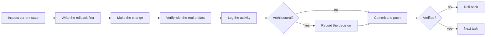
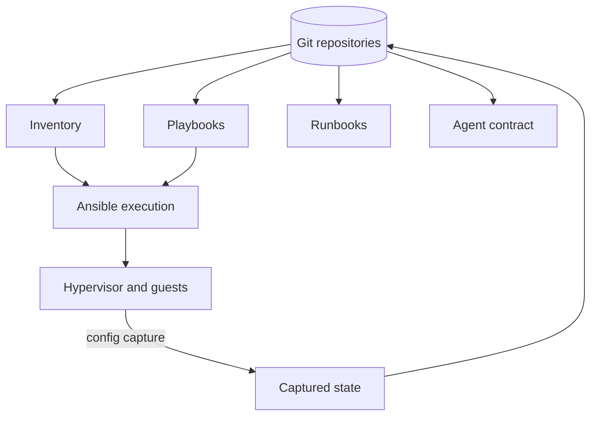
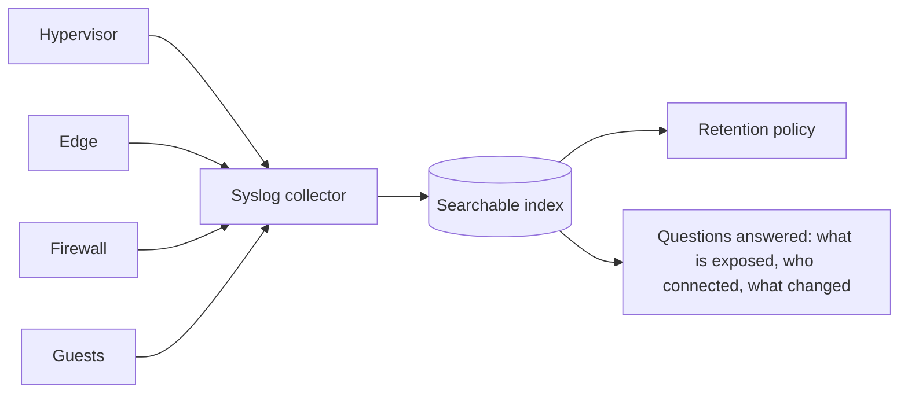
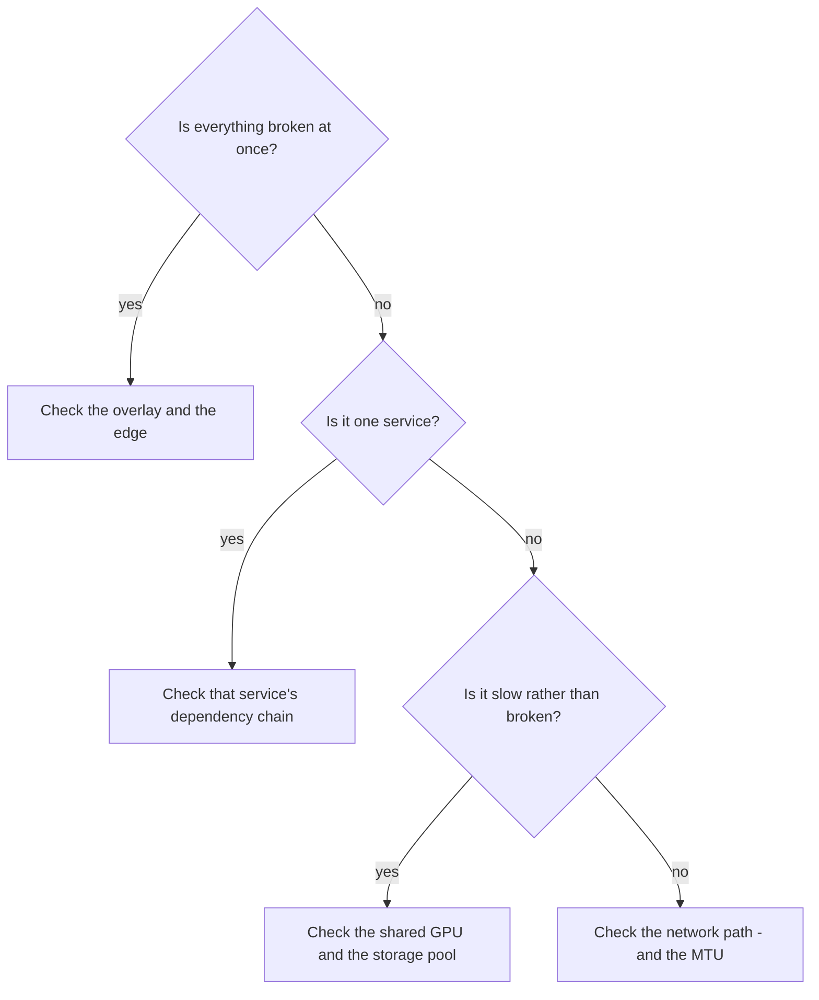

# Operations

_Detail behind the [README](../README.md)._

## The change loop

Every material change follows the same loop, whether a human or an agent is doing it.

Two steps are frequently skipped elsewhere and are non-negotiable here:

**Write the rollback first.** If the change cannot be undone, that fact should be known *before* it is
made, not discovered during the incident.

**Verify with the real artifact.** A service that validates is not a service that works. Several of this
lab's most expensive mistakes were configurations that passed every check and did nothing.

## Configuration as code

| Thing | Where it lives |
|---|---|
| Patching, verification, config capture | Ansible inventory, playbooks, host vars |
| Host configuration snapshots | Captured into Git on a schedule |
| Per-service rebuild instructions | One runbook per service |
| Agent behaviour and rules | The operating repository's contract and workspace |
| The narrative (this) | This repository |

**Why capture configuration:** it turns a rebuild from archaeology into a diff. A host whose
configuration is in Git can be compared, reviewed, and restored.

## Observability

- **One index** for the whole estate, rather than a per-host log hunt.
- The **edge** logs are the record of what was published and what connected to it.
- The **firewall** logs are how zone policy is validated rather than assumed.
- Retention is deliberate: logs are only useful if the index does not fill the disk first.

**The failure to watch for:** observability outages are silent. If the collector's disk fills,
ingestion stops and nothing warns you — you simply stop having evidence.

## Backup and recovery

| Layer | Approach |
|---|---|
| Intent | Everything in Git; recovery of *intent* is a clone |
| Guest disks | Thin-provisioned on the hypervisor pool; capacity tracked before adding guests |
| Credentials | Managed secret store, backed up separately from the estate |
| Rollback | Written before each change, so undoing does not require re-deriving the original state |

**The uncomfortable truth about backups:** an untested restore is a hypothesis. The vault matters most
here — a password vault without a verified restore is a liability dressed as an asset.

## Recurring chores

| Cadence | Chore | Why |
|---|---|---|
| Daily | Index health, disk headroom | Both fail silently |
| Weekly | Patch window via Ansible; review failed units | Drift accumulates quietly |
| On change | Activity log entry, runbook update, config capture | The change is not finished until it is written down |
| Periodic | Exposure and firewall review | Policy rots as services come and go |
| Periodic | Restore test | A backup is only a backup once it has been restored |

## Conventions

| Convention | Reason |
|---|---|
| Names describe **roles** | The role is the durable part; the address is not |
| One guest, one purpose | Small blast radius, clear ownership |
| Static addresses, recorded in inventory | Automation needs determinism |
| No secrets in Git | History is forever |
| Verify by artifact | Configuration is not evidence |
| Log before moving on | Context is lost within a day |

## Incident triage order

When something is broken, the questions are asked in this order, because each one explains a larger
class of failure than the next:

The MTU item is not a joke. A tunnel that lacks working path-MTU discovery fails selectively on
payload size: small replies arrive, large ones never do, and the application looks flaky rather than
the network looking broken.

## Documentation completion gate

“All documentation” means both public and private repositories in the same change:

1. Update the private operating activity/decision logs and affected service runbooks.
2. Update the public handbook with the sanitized architecture, result and known limitations.
3. Use role placeholders only: no actual addresses, DNS names, credentials or internal access paths.
4. Scan all publication history, file names and commit metadata, not just the latest files.
   Pattern checks are a gate, not a substitute for reviewing meaning and context.
5. Push each repository explicitly and compare its remote branch with the intended local commit.
6. Verify the public content anonymously. Report incomplete checks as incomplete.

The operating repository's checkpoint timer does not synchronize the other repositories.
Never equate “private logs pushed” with “all documentation updated.”

## Recovery and monitoring evidence

The weekly backup job was corrected to include the vault and other stateful guests. A scratch
restore proved the vault data was present; browser login was not tested. All archives remain
on the hypervisor, so host loss remains an unresolved recovery gap.

An hourly deterministic monitor checks capacity, backup freshness, log growth, GPU pressure,
sidecars and published service health. Reports go to files and syslog; push alerts are still
pending. See [current status](current-status.md) for the boundary of each verification claim.
