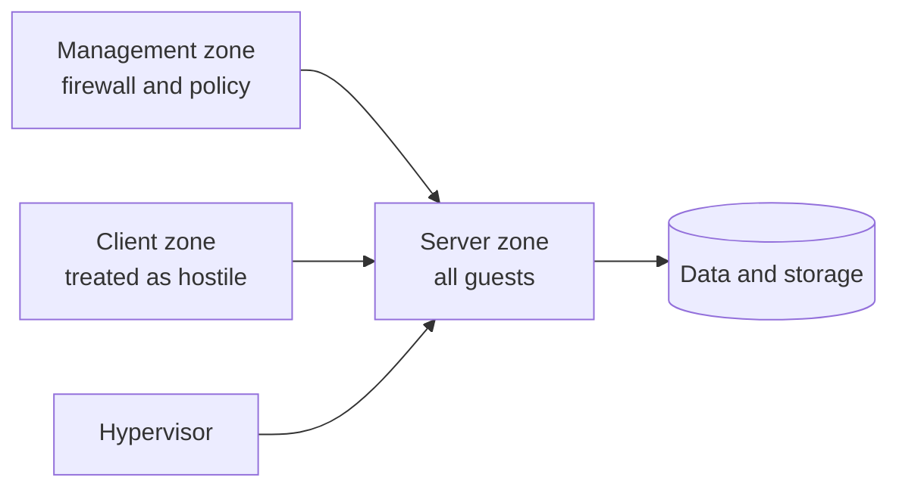

## How to read this map

| Label | Meaning |
|---|---|
| **passed** | A probe ran and the result matched the documented expectation. |
| **failed** | A probe ran and the result did *not* match the expectation. |
| **not tested** | No safe, authorised probe was possible. The row is configuration only. |
| **illustrative** | A teaching example, not a measurement. |

Segmentation is **not** presented as enforced unless a denied-path probe actually passed. Where a
path was not tested, it says so.

## Probes run on 2026-10-03 (16:47 UTC)

Narrowly scoped: one TCP connect attempt per target, three-second timeout, no scanning, no firewall
changes. Source was a server-zone agent host; targets are named by role, not address.

| # | From | To | Port | Expected | Actual | Label |
|---|---|---|---|---|---|---|
| 1 | Agent host (server zone) | Hypervisor management UI | 8006 | allow (management service) | connected | **passed** |
| 2 | Agent host (server zone) | Image-generation host, web UI | 7860 | allow (documented AI interface) | connected | **passed** |
| 3 | Agent host (server zone) | Edge host, public HTTPS | 443 | **deny** (edge firewall admits HTTP/HTTPS *only* from the proxy provider) | connection refused | **passed** |
| 4 | Agent host (server zone) | Image host, unregistered high port | 59999 | deny (no listener) | connection refused | **passed** |

**Probe 3 is the interesting one.** The edge host's public port is reachable from the internet
*through the provider*, but the host firewall refuses a direct connection from inside the lab. The
denied path therefore *is* enforced, and the probe proves it rather than asserting it.

## Hosts and zones

## Service map

| Service (role) | Zone | Reached by | Last verified | Label |
|---|---|---|---|---|
| Hypervisor management UI | Management | Operator, server zone | 2026-10-03 (probe 1) | passed |
| Image-generation host | Server | Agents, server zone | 2026-10-03 (probe 2) | passed |
| Public edge | Semi-trusted | Internet **via provider only** | 2026-10-03 (probe 3) | passed |
| Media front-ends | Server | Client zone (allowlisted) | - | **not tested** |
| Password vault | Server | Client zone (allowlisted) | - | **not tested** |
| Filtering DNS | Server | Client zone (allowlisted) | - | **not tested** |
| Log collector | Server | Server zone (forwarded logs) | - | **not tested** |
| Storage server | Server | Media front-ends (read-only export) | documented | **not tested** |

### Why so many rows are "not tested"

The client-to-server boundary is the one a visitor most wants proven, and it is the one this page
**cannot** prove with the access it has. A probe of that boundary must originate from the client
zone; no client-zone host is available to this build, and probing the boundary from a server-zone
host would measure a different path and prove nothing. Rather than dress up a server-side probe as
client-boundary evidence, those rows are marked untested and the blocker is recorded.

**The blocker, stated exactly.** *No authorised client-zone source host is attached to this build
environment, so the client-to-server allowlist cannot be exercised from the side that matters. The
rows above are configuration-derived. The next safe step is a single, rate-limited probe run from a
designated client-zone host, agreed with the operator.*

## What this page does not claim

- It does not claim the network is segmented by default-deny; the docs record client-to-server as
  **allowlisted, not universally denied**, and that caveat stands.
- It does not claim the untested rows are enforced. They are documented configuration.
- It does not publish addresses, credentials or internal hostnames.

*Probe evidence is recorded without addresses by design. The method is reproducible with the
documented build checks.*
